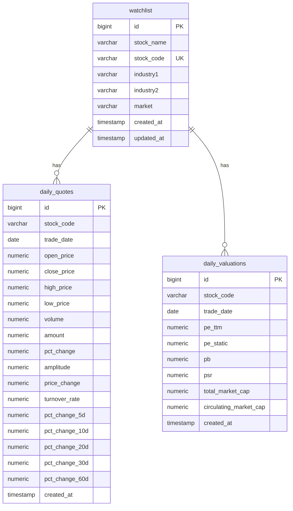

## 1. Architecture Design

```mermaid
graph TD
    A[React Frontend] --&gt; B[Supabase SDK]
    B --&gt; C[Supabase PostgreSQL]
    A --&gt; D[GitHub Pages Deployment]
```

## 2. Technology Description

- **Frontend**: React@18 + TypeScript + TailwindCSS@3 + Vite
- **State Management**: Zustand
- **Routing**: React Router DOM
- **Data Visualization**: Recharts
- **Icons**: Lucide React
- **Database**: Supabase (PostgreSQL)
- **Deployment**: GitHub Pages

## 3. Route Definitions

| Route | Purpose |
|-------|---------|
| / | 首页 - 行业概览、热门涨跌排行 |
| /industry/:industry1 | 行业详情页 - 行业表现、成分股列表 |
| /stock/:stockCode | 股票详情页 - 个股信息、历史行情 |

## 4. Data Model

### 4.1 Data Model Definition



### 4.2 Data Definition Language

已提供的表结构：

```sql
create table public.watchlist (
  id bigint generated always as identity not null,
  stock_name character varying(50) not null,
  stock_code character varying(20) not null,
  industry1 character varying(50) null,
  industry2 character varying(50) null,
  market character varying(50) null,
  created_at timestamp with time zone null default now(),
  updated_at timestamp with time zone null default now(),
  constraint watchlist_pkey primary key (id),
  constraint watchlist_stock_code_key unique (stock_code)
) TABLESPACE pg_default;

create table public.daily_quotes (
  id bigint generated always as identity not null,
  stock_code character varying(20) not null,
  trade_date date not null,
  open_price numeric(12, 2) null,
  close_price numeric(12, 2) null,
  high_price numeric(12, 2) null,
  low_price numeric(12, 2) null,
  volume numeric(20, 2) null,
  amount numeric(20, 2) null,
  pct_change numeric(8, 4) null,
  amplitude numeric(8, 4) null,
  price_change numeric(12, 2) null,
  turnover_rate numeric(8, 4) null,
  created_at timestamp with time zone null default now(),
  pct_change_5d numeric null,
  pct_change_10d numeric null,
  pct_change_20d numeric null,
  pct_change_30d numeric null,
  pct_change_60d numeric null,
  constraint daily_quotes_pkey primary key (id)
) TABLESPACE pg_default;

create unique INDEX IF not exists idx_daily_quotes_code_date on public.daily_quotes using btree (stock_code, trade_date) TABLESPACE pg_default;

create table public.daily_valuations (
  id bigint generated always as identity not null,
  stock_code character varying(20) not null,
  trade_date date not null,
  pe_ttm numeric(10, 2) null,
  pe_static numeric(10, 2) null,
  pb numeric(10, 2) null,
  psr numeric(10, 2) null,
  total_market_cap numeric(15, 2) null,
  circulating_market_cap numeric(15, 2) null,
  created_at timestamp with time zone null default now(),
  constraint daily_valuations_pkey primary key (id)
) TABLESPACE pg_default;

create unique INDEX IF not exists idx_daily_valuations_code_date on public.daily_valuations using btree (stock_code, trade_date) TABLESPACE pg_default;
```

## 5. File Structure

```
stock-monitor/
├── src/
│   ├── components/
│   │   ├── IndustryCard.tsx
│   │   ├── StockTable.tsx
│   │   ├── PriceChart.tsx
│   │   └── Header.tsx
│   ├── pages/
│   │   ├── Home.tsx
│   │   ├── IndustryDetail.tsx
│   │   └── StockDetail.tsx
│   ├── hooks/
│   │   ├── useStockData.ts
│   │   └── useIndustryData.ts
│   ├── utils/
│   │   ├── supabase.ts
│   │   └── formatters.ts
│   ├── types/
│   │   └── index.ts
│   ├── App.tsx
│   └── main.tsx
├── supabase/
│   └── config.js
├── .env
├── package.json
├── tsconfig.json
├── tailwind.config.js
├── vite.config.ts
└── README.md
```

