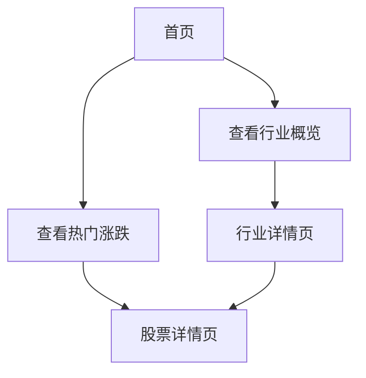

## 1. Product Overview
股票监测网站，用于日常跟踪关注的股票，按行业分类展示，支持查看各行业整体表现及不同周期涨跌幅较大的企业，部署在GitHub Pages供日常访问使用。

## 2. Core Features

### 2.1 User Roles
| Role | Registration Method | Core Permissions |
|------|---------------------|------------------|
| Visitor | No login required | Browse all data and features |

### 2.2 Feature Module
1. **首页**: 行业概览卡片、最新行情概览
2. **行业详情页**: 行业整体表现、行业内股票列表、不同周期涨跌幅排名
3. **股票详情页**: 个股基本信息、历史行情数据、估值指标

### 2.3 Page Details
| Page Name | Module Name | Feature description |
|-----------|-------------|---------------------|
| 首页 | 行业概览卡片 | 展示一级行业列表，显示行业平均涨跌幅、股票数量 |
| 首页 | 热门涨跌排行 | 展示不同周期（1日、5日、10日、20日）涨跌幅最大的股票 |
| 行业详情页 | 行业表现统计 | 显示行业整体涨跌幅、成分股列表、行业估值统计 |
| 行业详情页 | 行业内股票列表 | 展示行业内所有股票，支持按不同周期涨跌幅排序 |
| 股票详情页 | 基本信息 | 显示股票名称、代码、所属行业、市场 |
| 股票详情页 | 历史行情 | 展示价格走势、成交量、涨跌幅等数据 |
| 股票详情页 | 估值指标 | 展示PE、PB、PS、市值等估值数据 |

## 3. Core Process
用户访问网站 → 查看首页行业概览和热门涨跌排行 → 点击感兴趣的行业 → 查看行业详情和成分股 → 点击个股查看详细信息。

## 4. User Interface Design

### 4.1 Design Style
- **主色调**: 深蓝色 (#1e3a8a) 搭配绿色 (#10b981) 表示上涨，红色 (#ef4444) 表示下跌
- **辅助色**: 灰色系 (#f3f4f6, #6b7280, #111827)
- **按钮风格**: 圆角矩形，悬停有轻微缩放动画
- **字体**: 采用 Inter 字体家族，标题使用较粗字重
- **布局风格**: 卡片式布局，清晰的信息层级
- **图标风格**: 使用 lucide-react 图标库，线性风格

### 4.2 Page Design Overview
| Page Name | Module Name | UI Elements |
|-----------|-------------|-------------|
| 首页 | 行业概览卡片 | 网格布局，每个行业一个卡片，显示行业名称、股票数量、平均涨跌幅，带微妙的渐变背景 |
| 首页 | 热门涨跌排行 | 表格形式，支持切换不同周期，涨跌用颜色区分 |
| 行业详情页 | 行业表现统计 | 顶部统计区域，显示核心指标，下方成分股列表 |
| 股票详情页 | 历史行情 | 趋势图展示，关键数据高亮显示 |

### 4.3 Responsiveness
- 桌面端优先设计，自适应平板和移动端
- 响应式网格布局，在小屏幕上调整列数
- 触摸优化，确保按钮和可点击区域足够大

